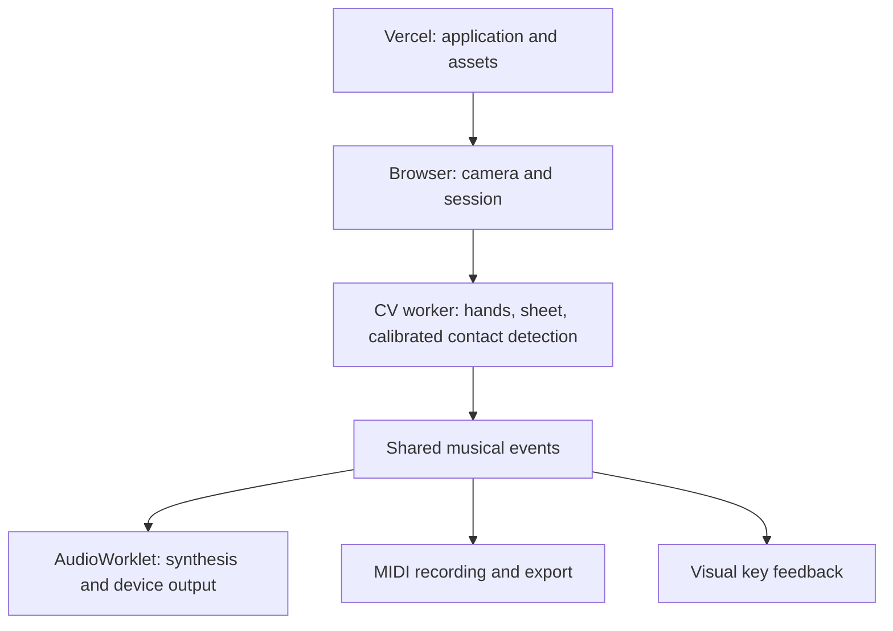

# MakeShift Browser Architecture

Direction established by [#85](https://github.com/Kakrl/MakeShift/issues/85).
This document specifies the target. The status table distinguishes existing
code from planned work; execution evidence belongs in the
[verification inventory](../tests/verification_test_inventory.md).

## Product and runtime boundaries

MakeShift turns a printed keyboard and webcam into a virtual piano. Accurate
intentional presses, releases and pitch, and low-latency sound take priority
over visual effects. Scope includes calibration, one to three octaves, starting
note selection, velocity-sensitive playback, feedback, and MIDI recording/export.

Vercel serves the application and assets. Camera capture, live CV, note detection,
synthesis, and MIDI generation execute on the user's device. A monorepo deployment
does not combine browser and server processes or give a server access to a
visitor's speakers. Future server APIs stay outside the per-note path. Live
playing requires no video upload, per-note HTTP request, or WebRTC connection.

## Current implementation versus target

| Area | Existing implementation | Planned delivery |
| :--- | :--- | :--- |
| UI/camera | Next.js/React camera and calibration UI | Validated session lifecycle (#24, #87) |
| CV | MediaPipe still-image helper, video overlay code, OpenCV.js marker/geometry modules | Worker pipeline and intentional contact detection (#37, #34); module presence does not establish UI integration |
| Calibration | Prototype flow/completion flag; known defect D6 | Versioned validated result (#87) |
| Native audio | C++ PortAudio, nanobind, SPSC queue; ten 100 ms decaying sine hits at 44.1 kHz | Remains a native reference |
| Browser audio | AudioContext count-in click | AudioWorklet synthesis, held notes and envelopes (#35, #27, #28) |
| MIDI | midi-writer-js utilities and tests; UI/export gap D2 | Complete lifecycle and download (#88) |
| Verification | Native audio/queue, MIDI, contrast, RCA suites; Python placeholder | Browser audio, labeled CV, physical latency and deployment tests (#39, #30, #89) |

See [known defects](../tests/README.md#known-defects). Native tests do not establish
browser correctness. This change does not remove the native engine or claim its
hit API supports note-off.

## Execution ownership and frame handling

| Context | Responsibility |
| :--- | :--- |
| Main thread/session controller | User activation, camera lifecycle, worker coordination, calibration/configuration revisions, UI |
| CV worker | Expensive inference, marker tracking, geometry, contact state and musical events |
| AudioWorklet | Fixed voice pool, envelope state, mixing; no network or blocking work |
| MIDI consumer | Recording timeline and file generation; cannot delay audio dispatch |
| Vercel | Application, worker/worklet modules, models and WASM assets; independently justified APIs |

Schedule newly available frames and bound pending work. Prefer recent frames to
a backlog, count dropped frames, and evaluate missed brief presses. Document
frame transfer/copy costs and ownership; dispose of transferred resources.
Reuse detectors. Stop media tracks and close workers/models when sessions end.
Use VIDEO inference for live frames while preserving still-image calibration.

Begin with ordinary worker messaging and bounded application queues. #86 must
define overload recovery: dropping a release must not leave a stuck note.
Audio delivery must not await a React render or MIDI serialization. Direct
message ports may be used where appropriate; shared memory requires profiling
evidence and documented deployment constraints.

## Calibration, geometry and contact

The versioned result contains coordinate conventions, sheet transform, keyboard
configuration, camera/frame compatibility properties, and contact-model inputs.
Validate persisted data, unsupported versions and storage failures. Define
recovery when camera, sheet or configuration changes; a boolean cannot establish
continued validity.

Separate canonical keyboard geometry from camera-space projection. Cache stable
inputs, invalidate or reproject when inputs change, and make detection/drawing
use the same geometry revision. Map key IDs to configured MIDI pitches in browser
TypeScript; a backend spatial hash is not required.

Polygon overlap alone does not prove contact. #34 defines the calibrated model,
finger/press identity, hover/press/hold/release transitions, velocity estimation,
occlusion and same-key multi-finger behavior. Relative hand-landmark depth is not
automatically a calibrated distance from the paper. #29 tunes confidence and
hysteresis against both accuracy and delay rather than assuming 25 ms debounce.

## Event and clock contract

#86 owns the exact schema. Required semantics are note-on, note-off and
release-all, with MIDI pitch, normalized note-on velocity, monotonic timestamp,
session ID and press ID where applicable. Coordinates remain CV inputs.

Specify ordering, malformed/duplicate events, repeated pitches and same-key
multi-finger policy. Match releases to presses; a late release for a stolen
voice must not stop its replacement. Reject old-session events and avoid mixing
old calibration with a new geometry revision.

Name timestamp units and origins. Separate observation/event time from processing
and delivery time. Frame timestamps do not automatically measure physical contact
or sensor exposure. Explicitly convert worker/main clock origins and map them
to AudioContext time and MIDI recording time. Re-establish audio-clock mapping
after suspension/resume. Specify late-event handling without an unnecessary fixed
look-ahead delay. Test clock offsets, delayed messages, resets and pause/resume.

## Audio decision

Start with JavaScript synthesis in an AudioWorklet. Ten simple sine voices do
not alone justify WebAssembly complexity. Reconsider a port for measured
improvements or reusable complex C++ DSP; separate synthesis from PortAudio and
nanobind if selected. WebAssembly cannot remove camera or device buffering.

Request `latencyHint: "interactive"`, treating it as a hint rather than a
guarantee. Initialize/resume audio through user interaction. Use the actual
sample rate, up to ten preallocated voices, bounded finite output, velocity,
deterministic stealing, and smooth attack/release. #27 defines ADSR transitions;
envelopes alone do not provide realistic piano timbre. Avoid blocking calls,
network, per-buffer logging and avoidable allocations in rendering.
Offline samples and actual audible output require separate verification.

## Session and recording lifecycle

#24 gates detected-note playback on valid calibration, usable tracking and ready
audio. Define startup, playing, interruption, stopped and error states.
Stop, invalidation and unusable tracking release notes; recovery must not replay
old queued input. New sessions have new identities. #89 verifies denial/loss of
camera, backgrounding, navigation, audio suspension and restart. Errors provide
a recovery action.

#88 consumes the same musical lifecycle with explicit start/pause/resume/stop
policies, held-note handling and paused-time treatment. Stop closes recorded
notes and prevents later writes. Recordings have independent state and export
a MIDI file. Audio cannot await file generation.

## Tooling and delivery

| Area | Existing tools / planned additions |
| :--- | :--- |
| Application | Next.js, React, TypeScript, npm lockfile |
| CV | MediaPipe Tasks Vision, OpenCV.js/ArUco; live worker pipeline planned |
| Audio | Native PortAudio and browser count-in exist; AudioWorklet synthesis planned |
| MIDI | midi-writer-js; complete UI integration planned |
| Native reference | C++23, CMake, PortAudio, nanobind, Python 3.12 |
| Quality | Vitest, ESLint, TypeScript, contrast audit, build; GoogleTest/CTest, Ruff, mypy, clang-format for relevant areas |
| Browser/system | Selenium/fake-camera fixtures planned; real camera/audio checks still required |
| Performance | Browser Performance tools, bounded instrumentation (#38), physical harness (#30) planned |
| Delivery | GitHub Actions exists; Vercel runtime verification tracked by #89 |

Versions belong in manifests/lockfiles. Keep JS/WASM/model assets compatible and
avoid CDN `latest`. Verify production asset loading. Emscripten is optional
future tooling, not an existing dependency.

Use [AGENTS.md checks](../AGENTS.md#checks-to-run) and
[test commands/layout](../tests/README.md#running-the-tests). Frontend tests,
helpers and fixtures go in `tests/frontend/`, runner configuration in
`frontend/`. A workflow's existence does not prove tests ran; D3's Vitest CI
gap is not fixed here. Hardware checks explicitly skip when unavailable.
Critical manual tests use the manual report template.

## Accuracy and latency verification

The [RVTM addendum](rvtm_browser_addendum.md) preserves requirement IDs and maps
the new architecture to tests. Under 50 ms physical-press-to-audible-output and
under 3% combined detection errors are targets, not achieved results.

Frames at 30 fps are about 33.3 ms apart; at 60 fps about 16.7 ms apart. Prefer
60 fps where supported, but measure delivered rate and image quality. Capture,
inference, confirmation, scheduling and device buffering all consume the budget.
Resolution, smoothing and frame-rate changes need joint accuracy/latency evidence.
Neither AudioWorklet nor WebAssembly guarantees compliance.

#38 measures stages and diagnostic overhead. #30 captures physical press reference
and output audio on a shared/calibrated timeline, validates onset analysis and
reports uncertainty. Software timestamps and a manual stopwatch cannot establish
sub-50 ms physical latency. Report sample count, p50/p95, maximum, proportion over
50 ms, browser, camera settings, hardware and output device. Separate startup
from warm playback and wired/built-in baseline from Bluetooth.

#39 defines event matching and the combined-error denominator before tuning.
Do not silently substitute another metric. Report wrong pitches, duplicate
triggers, missed releases, stuck notes and chord failures. Use labeled footage
across lighting, angles, hand sizes, speeds and occlusion, separating tuning
and held-out data. Define pass/fail rules in the verification plan and report
unmet requirements or unsupported configurations.

## Implementation boundaries

These links identify work ownership, not completion.

| Issues | Responsibility |
| :--- | :--- |
| [#85](https://github.com/Kakrl/MakeShift/issues/85) | Documentation direction |
| [#86](https://github.com/Kakrl/MakeShift/issues/86) | Event/session/clock contract |
| [#87](https://github.com/Kakrl/MakeShift/issues/87), [#8](https://github.com/Kakrl/MakeShift/issues/8) | Validated calibration; calibration feedback |
| [#36](https://github.com/Kakrl/MakeShift/issues/36), [#25](https://github.com/Kakrl/MakeShift/issues/25), [#76](https://github.com/Kakrl/MakeShift/issues/76) | Layout; pitch mapping; geometry cache |
| [#37](https://github.com/Kakrl/MakeShift/issues/37) | Worker/frame scheduling and resource lifecycle |
| [#34](https://github.com/Kakrl/MakeShift/issues/34), [#29](https://github.com/Kakrl/MakeShift/issues/29) | Contact state/velocity; jitter suppression |
| [#35](https://github.com/Kakrl/MakeShift/issues/35), [#27](https://github.com/Kakrl/MakeShift/issues/27) | Synthesizer; envelopes |
| [#24](https://github.com/Kakrl/MakeShift/issues/24) | Readiness and interruption policy |
| [#88](https://github.com/Kakrl/MakeShift/issues/88), [#65](https://github.com/Kakrl/MakeShift/issues/65) | MIDI lifecycle/export; type compatibility |
| [#28](https://github.com/Kakrl/MakeShift/issues/28) | Connect delivered subsystems and verify playing |
| [#39](https://github.com/Kakrl/MakeShift/issues/39), [#38](https://github.com/Kakrl/MakeShift/issues/38), [#30](https://github.com/Kakrl/MakeShift/issues/30) | Accuracy suite; stage/resource profiling; physical latency |
| [#89](https://github.com/Kakrl/MakeShift/issues/89) | Deployed compatibility/recovery and CI |

Contract fixtures allow independent consumer development. #28 does not absorb
each subsystem's implementation. Benchmark delivery does not mean the product
meets its benchmark. Cloud storage, remote collaboration, native-engine removal,
and a WebAssembly migration are outside this documentation change.

## Platform references

- [MediaPipe web hand tracking](https://developers.google.com/edge/mediapipe/solutions/vision/hand_landmarker/web_js): synchronous inference, VIDEO mode and worker guidance.
- [AudioWorklet](https://developer.mozilla.org/en-US/docs/Web/API/AudioWorklet): browser audio processing thread.
- [Vercel Python runtime](https://vercel.com/docs/functions/runtimes/python): server runtime remains distinct from the browser.
